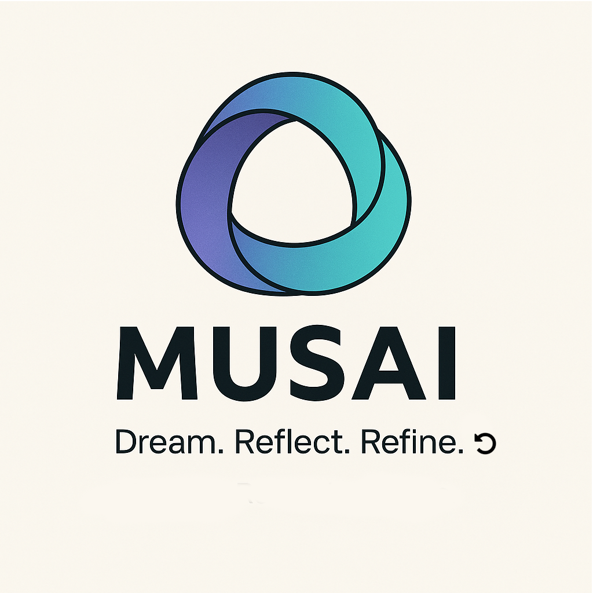
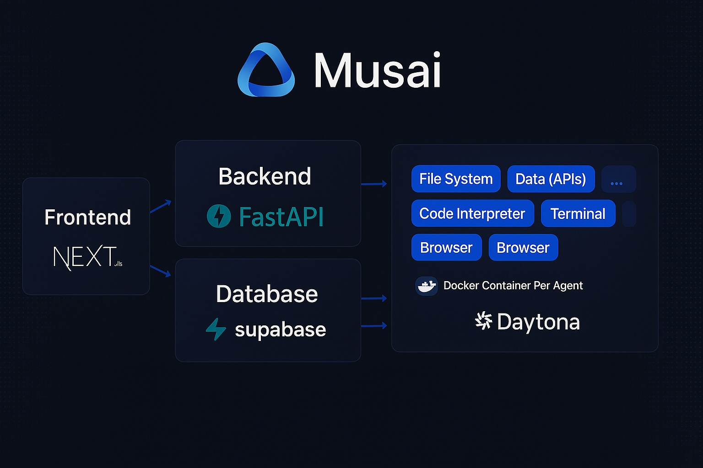

<div align="center">

# Musai — The Modular Muse Within

**Reflective AI for Recursive Minds**



Musai is a fully open-source, modular AI agent designed to amplify your creative and cognitive capabilities. It acts on your behalf to research, reflect, refine, and realize tasks through intelligent conversation. Whether you're building, learning, creating, or organizing, Musai becomes your adaptive digital muse—bridging raw data and emergent insights.

Its architecture combines flexible backend services, secure isolated agents, and a powerful user interface—allowing seamless API interaction, real-world automation, and thoughtful reflection loops.

[](./license)
[](https://discord.gg/Py6pCBUUPw)
[](https://github.com/kortix-ai/suna)

</div>

---

## Table of Contents

* [Musai Architecture](#musai-architecture)

  * [Backend API](#backend-api)
  * [Worker](#worker)
  * [Frontend UI](#frontend-ui)
  * [Supabase Integration](#supabase-integration)
* [Core Philosophy](#core-philosophy)
* [Key Use Cases](#key-use-cases)
* [Self-Hosting](#self-hosting)
* [License](#license)

## Musai Architecture



Musai's architecture is intentionally modular. You can run the core components only, or extend it with additional tools and services as needed.

### Backend API

Built in Python using FastAPI, the backend manages:

* REST endpoints and auth
* Task orchestration
* LLM routing via LiteLLM (OpenAI, Anthropic, etc.)
* Prompt tools and memory integration

### Worker

Handles async background processing like crawling, uploading, or data-heavy computations. Built with Dramatiq and optionally Redis.

### Frontend UI

A Next.js/React-based chat interface for interacting with your agents. Designed to be extensible, intuitive, and responsive.

### Supabase Integration

Manages:

* Auth & sessions
* File & chat history
* Real-time updates
* Project data syncing

## Core Philosophy

Musai isn't just an assistant. It's an interface between your intent and realization. A reflective system that helps you:

* **Dream** with expansive prompts and ideation tools
* **Reflect** on evolving context and nuanced meaning
* **Refine** across iterations of conversation, content, and creation
* **Realize** through automation, action plans, and deliverables

Inspired by the recursive nature of thought and language, Musai supports:

* Modular tool loading
* Agent memory
* Prompt chaining
* Secure isolated execution (via Docker)

## Key Use Cases

* Knowledge Research + Summarization
* Automation of repetitive workflows
* File parsing and editing (PDFs, docs, spreadsheets)
* SEO and Web Audit Tools
* Trip Planning and Logistics
* Personal Productivity
* Custom API Chaining / App Building
* Agent-as-a-Service Experiments

## Self-Hosting

Musai can be self-hosted in modular fashion.

### Minimum Viable Setup:

* `musai-backend` (FastAPI server)
* `musai-worker` (optional job processor)
* `Supabase` (auth, storage, db)

> Advanced configurations may include Redis, QStash, Tavily, Daytona, or Langfuse integrations—but are not required.

### Quick Start:

```bash
git clone https://github.com/YOUR-FORK/musai.git
cd musai
python setup.py  # Coming soon
```

Then run your dev server:

```bash
docker-compose up -d
```

You can also develop locally on macOS and deploy later to container-based hosting (e.g., Railway, Fly.io, or your own VPS).

## License

Musai is adapted from the original Suna project and restructured under the Apache 2.0 License.

See [LICENSE](./LICENSE) for full terms.

> Forked from [kortix-ai/suna](https://github.com/kortix-ai/suna) with modular adaptations, rebranding, and reimagined philosophy by [@CodeMusai](https://github.com/your-profile).
